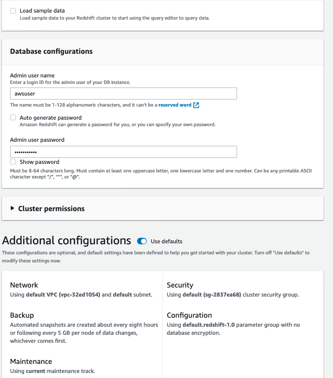
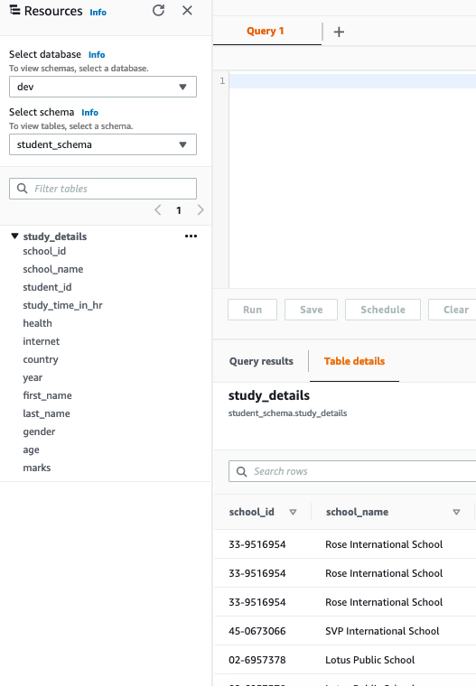
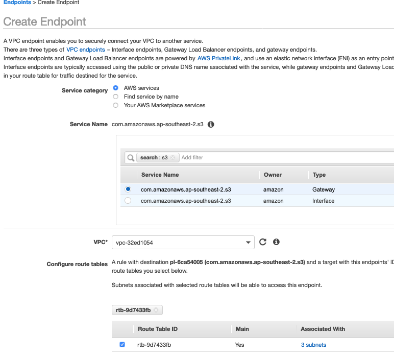
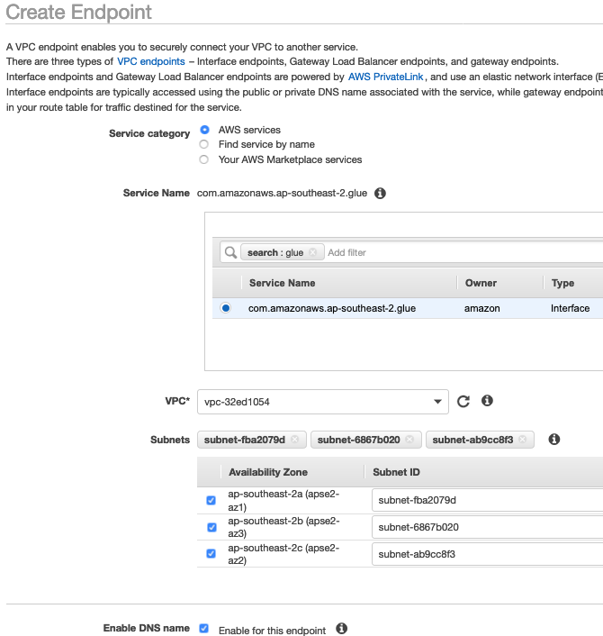
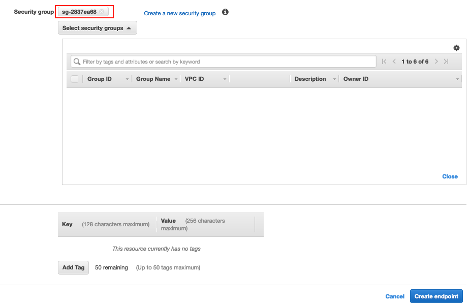
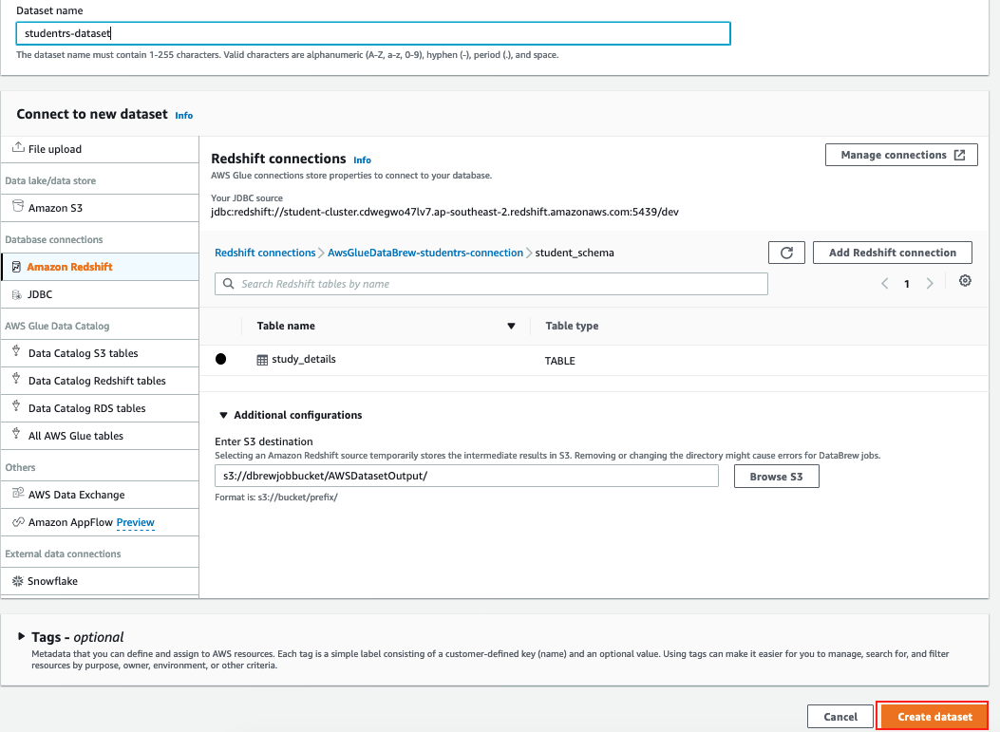

# Data preparation using Amazon Redshift with AWS Glue DataBrew
This lab is provided as part of [AWS Innovate Data Edition](https://aws.amazon.com/events/aws-innovate/data/), click here to explore the full list of hands-on labs.
ℹ️ You will run this lab in your own AWS account and running this lab will incur some costs. Please follow directions at the end of the lab to remove resources to avoid future costs.

## Table of Contents  
* [Overview](#overview)  
* [Architecture](#architecture)  
* [Pre-Requisites](#pre-Requisites)  
* [Setting up Amazon Kinesis Data Generator Tool](#setting-up-amazon-kinesis-data-generator-tool)  
* [Kinesis Analytics Pipeline Application setup](#kinesis-analytics-pipeline-application-setup)
* [Configure Output stream to a Destination](#configure-output-stream-to-a-destination)
* [Test E2E Architecture](#test-e2e-architecture)
* [Cleanup](#cleanup)

## Overview

In this lab we will use AWS Glue DataBrew to prepare data from Amazon Redshift. We will explore a student dataset stored in Amazon Redshift containing details of school id, name, age, country, gender, number of study hours and marks. We will use AWS Glue DataBrew to connect to Redshift cluster and ingest data. This data will then be prepared, cleaned and made ready for a downstream machine learning process.  

With AWS Glue DataBrew, users can evaluate the quality of your data by profiling it to understand data patterns and detect anomalies. They can also visualize, clean, and normalize data directly from your data lake, data warehouses, and database including Amazon S3, Amazon Redshift, Amazon Aurora, and Amazon RDS.

Now, with added support for JDBC-accessible databases, DataBrew also supports additional data stores, including PostgreSQL, MySQL, Oracle, and Microsoft SQL Server. In this post, we use DataBrew to clean data from an Amazon Redshift table, and transform and use different feature engineering techniques to prepare data to build a machine learning (ML) model. Finally, we store the transformed data in an S3 data lake to build the ML model in Amazon SageMaker.

## Architecture
In this lab we will setup the following architecture. The architecture will have several components explained below.


#### Components
1. VPC - The Amazon Virtual Private Cloud (VPC) will host the Private subnet where the Amazon Redshift cluster will be hosted. In this lab, we will use the default VPC.
2. Private Subnet - The Private subnet will host Elastic Network interface for the Redshift cluster. In this lab we will use the default Subnet. Note: The default is attached to the internet gateway and thus is not private for the lab purposes.
3. Elastic Network Interface (ENI).
4. Security Group - The Security group will specify the inbound and outbound rule to secure the network traffic coming in and going out of the ENI. In this lab we will alter the existing security group.
5. Amazon Redshift - Amazon Redshift will host the student dataset for this lab
6. AWS Glue - The AWS Glue DataBrew created connection to Amazon Redshift will be housed in the AWS Glue service
7. Amazon S3 - The Amazon S3 will store any Glue DataBrew intermediate logs and outputs from the DataBrew recipes.
8. Glue Interface Endpoint - An interface endpoint will make AWS Glue service available within the VPC.
9. S3 Gateway Endpoint - A gateway endpoint will make Amazon S3 service available within the VPC.
10. AWS Glue DataBrew - This service will connect to the student dataset in Amazon Redshift. The Service will allow users to prepare the data and create a reusable recipe to refine the data to make it available to AI/ML services like AWS Sagemaker.

## Step 1 - Create RedShift Cluster
1. Navigate to the [Amazon Redshift](https://ap-southeast-2.console.aws.amazon.com/redshiftv2/home?region=ap-southeast-2#dashboard) service in the AWS Console.
2. Click on create cluster and name the cluster ``student-cluster``.
3. You could choose the **Free Trial** option which will create a cluster will sample data. For this lab we will choose **Production**. 
                
4. Leave the checkbox for **Load Sample data** unchecked
5. Use defaults for VPC and Security group. **Note the security group.** We will alter the inbound and outbound rules for this security group at a later step.
                
6. Select Create Cluster.

## Step 2 - Setup Student Dataset
1. In the Redshift Console open the Query Editorfrm the side panel
                
2. Connect to the 'dev' db which is created during the creation of the Cluster.
                
3. In the query editor run the [DDLSchemaTable.sql](./scripts/SQL/DDLSchemaTable.sql)
4. This will create ```student_schema``` schema and a table ```study_details``` within the schema.
5. Following this run the [studentRecordsInsert.sql](./scripts/SQL/studentRecordsInsert.sql) to insert the sample student dataset for the lab.
                
6. View the data student data loaded in Redshift
                        

## Step 3 - Create VPC Endpoints
#### S3 Gateway Endpoint
1. Navigate to the [VPC service](https://ap-southeast-2.console.aws.amazon.com/vpc/home?region=ap-southeast-2) in the AWS Console.
2. Select the Endpoints option from the left pane.
3. Create a VPC Endpoint by selecting the 'Create Endpoint'.
4. Set the servict category as AWS services and search for the S3 service.
5. Select the service with type Gateway.
                
6. The default VPC should be selected by default else select the VPC where the redshift cluster was created.
7. Leave other options as is, scroll down, and click on 'Create Endpoint'
                
#### Glue Interface Endpoint
1. Create a VPC Endpoint by selecting the 'Create Endpoint'.
2. Set the servict category as AWS services and search for the Glue service.
3. Select the service with type Interface.
                
4. The default VPC should be selected by default else select the VPC where the redshift cluster was created.
5. Leave other options as is, scroll down, and click on 'Create Endpoint'
                

## Step 4 - Alter Security Group Rules
1. Go to the [Security group](https://ap-southeast-2.console.aws.amazon.com/ec2/v2/home?region=ap-southeast-2#SecurityGroups:) feature in the EC2 Console.
2. Fetch the security group noted in [Step1](#step-1---create-redshift-cluster)
3. Alter the inbound rules like so.
                
4. Alter the outbound rules like so. While altering the outbound rules, ensure that the prefix list selected (pl-xxxxx) match the prefix list created for the S3 VPC endpoint.
                

## Step 5 - Create an S3 bucket
1. Go to the [S3 Console](https://s3.console.aws.amazon.com/s3/home?region=ap-southeast-2) and click on create bucket.
2. S3 buckets have to unique. Select a unique name and create bucket.
3. Create 2 folders namely, ```AWSDatasetOutput``` and ```recipeJobOutput``.
                

## Step 6 - Prepare data using DataBrew
#### Create new connection
1. Go to the [AWS Glue DataBrew](https://ap-southeast-2.console.aws.amazon.com/databrew/home?region=ap-southeast-2#landing).
2. On the left pane select Datasets and navigate to the Connections tab.
                
3. Create a new Connection.
4. Enter the Connection name as ```students-connection```.
5. Select 'Amazon RedShift' as the Connection type.
6. Select the Redshift cluster, the database name, the AWS User and the password that was used to create the cluster. 
                
#### Create new dataset
1. Select the created connection and click on 'Create dataset with this connection'.
2. The connection name should be auto-populated. Select the table, ```study_details```.
3. Enter the s3 destination as ```s3://bucket-name/AWSDatasetOutput/
4. Click on Create dataset.
                 


https://docs.aws.amazon.com/redshift/latest/gsg/rs-gsg-create-an-iam-role.html
https://docs.aws.amazon.com/glue/latest/dg/setup-vpc-for-glue-access.html
https://docs.aws.amazon.com/redshift/latest/gsg/rs-gsg-launch-sample-cluster.html


https://docs.aws.amazon.com/redshift/latest/gsg/t_creating_database.html


https://docs.aws.amazon.com/redshift/latest/mgmt/connecting-using-workbench.html
https://www.sql-workbench.eu/manual/install.html

Create Schema and Tabnle
https://raw.githubusercontent.com/aws-samples/data-transformation-of-redshift-using-glue-databrew/main/DDL.sql

Insert into study_details
https://raw.githubusercontent.com/aws-samples/data-transformation-of-redshift-using-glue-databrew/main/insert_sql.sql

create role automatically for databrew
Did not work--adn also s3 gateway endpoint(https://docs.aws.amazon.com/databrew/latest/dg/vpc-endpoint.html)

New role required as per 
1. https://docs.aws.amazon.com/databrew/latest/dg/setting-up-iam-policy-for-data-resources-role.html
2. https://docs.aws.amazon.com/databrew/latest/dg/setting-up-iam-role-to-use-in-databrew.html


Before next step make sure you have an iam policy created.. and a role associated. Link to the Public website
talk about additionally you need


Create databrew project from a dataset
createnewprojectfromds.png

createdbrewproject-1.png


Before creating a Profile job view the column statistics.  noColumnStatistics.png

Create a profiling job
createJobsProfiles.png

Create Job> JOb name: student-profile-job
Create a Profile Job Select a data set
Provide the S3 location for job output.
For Role name, choose the role to be used with DataBrew.
Choose Create and run job.

createProfileJobSetting.png
createProfilejob.png

jobcompletion.png

View column statistics post run.
columnstatistics.png

View the data linege
datalineageview.png

show missing data 
missingdataage.png
columnstatistics-2.png

refine output to sage by deleting columns
refineinputtosage.png
refineinputtosage-2.png

We know from the profiling report that the age value is missing in two records. Let’s fill in the missing value with the median age of other records.

    Choose Missing and choose Fill with numeric aggregate.


fillMissingwithAggregate.png
fillMissingwithAggregate-2.png


The next step is to convert the categorical value to a numerical value for the gender column.

    Choose Mapping and choose Categorical mapping.
    CategoryMapping.png
    For Source column, choose gender.
For Mapping options, select Map top 2 values.
For Map values, select Map values to numeric values.
For F, choose 1.
For M, choose 2.

categoricalmapping.png

destinationmapped.png
For Destination column, enter gender_mapped.
For Apply transform to, select All rows.
Choose Apply.

ML algorithms often can’t work on label data directly, requiring the input variables to be numeric. One-hot encoding is one technique that converts categorical data that doesn’t have an ordinal relationship with each other to numeric data.

To apply one-hot encoding, complete the following steps:

    Choose Encode and choose One-hot encode column.

onehotencode.png
    onehotencode-2

Perform a few more similar changes and then View Recipe
viewrecipe.png
importdownloadrecipe.png

Publish and view receipe
PublishRecipe.png
viewpublshedrecipe.png

CreateJob with recipe
createjobwithrecipe.png

Enter the job name, 
For Job name¸ enter student-performance.

createrecipejob-s3output

We use CSV as the output format.

    For File type, choose CSV.
    For Role name, choose an existing role or create a new one.
    Choose Create and run job.

    Set perms and submit

    Output from a recipe job
    outputfromrecipejob-1.png
    outputfromrecipejob-2.png
outputfromrecipejob-3.png - in an excel


